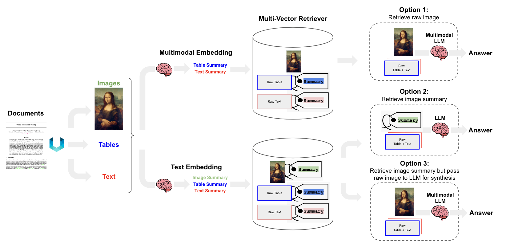

# RAG-n-Roll-Extractor

A professional Retrieval-Augmented Generation (RAG) extraction tool that helps process and prepare documents for RAG applications.

## Architecture



*Image source: [LangChain Cookbook - Semi-structured and Multi-modal RAG](https://github.com/langchain-ai/langchain/blob/master/cookbook/Semi_structured_and_multi_modal_RAG.ipynb)*

## Features

- [Coming soon]

## Installation

```bash
# Clone the repository
git clone https://github.com/andykofman/RAG-n-Roll-Extractor.git
cd RAG-n-Roll-Extractor

# Install using Poetry
poetry install
```

## Usage

[Coming soon]

## Project Structure

```

```

## Development

### Setup Development Environment

```bash
```

### Contributing

1. Fork the repository
2. Create your feature branch (`git checkout -b feature/amazing-feature`)
3. Commit your changes (`git commit -m 'Add some amazing feature'`)
4. Push to the branch (`git push origin feature/amazing-feature`)
5. Open a Pull Request

## License

[MIT License](LICENSE)

## Authors

- A.Ali (ali.a@aucegypt.edu) 